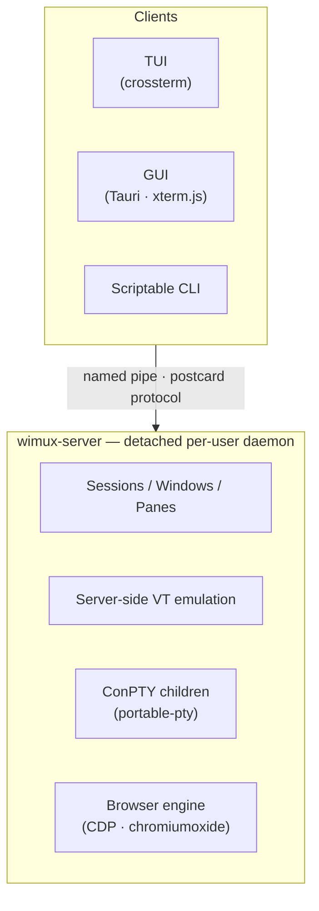

<div align="center">


# wimux

**The terminal multiplexer Windows never had.**

Persistent sessions, a native GUI, a driveable browser, and AI sub‑agent orchestration — built for PowerShell and Windows Terminal, in Rust.

[](https://github.com/fabperso/wimux/actions/workflows/ci.yml)
[](https://crates.io/crates/wimux)
[](LICENSE)


</div>

---

## Why wimux?

`tmux` and `zellij` are Unix‑first. On Windows they run only inside WSL, detached from the native shell. **wimux is a multiplexer designed for Windows from the ground up** — it speaks ConPTY, drives PowerShell natively, and survives your terminal closing, just like tmux does on Linux.

Then it goes further than a tmux clone:

- 🪟 **A real native GUI** (not just a TUI) — panes, tabs, mouse, drag‑to‑resize, right on top of the same detached server.
- 🌐 **A browser you can embed *and* drive** — preview your dev server in a pane, or automate a real Chromium via CDP.
- 🤖 **AI sub‑agent orchestration built in** — spawn agents into their own panes, or fan a task out across isolated git worktrees, and collect the results.

## Highlights

- **Persistent, detached sessions.** One per‑user server owns your sessions and survives any client closing. `wimux new -s dev` → close the window → `wimux attach dev` and it's still there.
- **Three ways to drive it, one server:** a **TUI** client, a native **GUI**, and a fully **scriptable CLI** — all attach to the same source of truth.
- **tmux‑style muscle memory.** `Ctrl‑b` prefix, splits, windows, zoom, a vi‑style copy mode with search, and mouse support.
- **Scriptable by design.** `send-keys`, `split-window`, `capture-pane`, `list-panes` — automate a session without ever attaching to it.
- **Embedded browser panes.** A layout pane can be a browser (🌐); it's owned by the server and survives GUI restarts, URL and all.
- **Driveable headless browser (CDP).** `navigate`, `snapshot`, `click`, `type`, `eval`, and more — accessibility‑ref targeting, headless by default for reliable input.
- **AI‑agent orchestration.** `wimux agent` runs sub‑agents in journaled panes; `wimux batch` fans a task out across isolated git worktrees and reviews the results.
- **Written in Rust.** A detached daemon, a binary protocol over named pipes, server‑side VT emulation, ConPTY child processes — strip‑optimized release builds.

## Demo


*One session: a shell, a live dev‑server preview, and an AI sub‑agent answering in its own pane — then switch workspaces, everything keeps running.*

| GUI — panes & tabs | Agent orchestration | Browser pane |
| :---: | :---: | :---: |
|  |  |  |

## Quick start

### Install (Windows 10/11, x64)

**With Cargo** — CLI + daemon, straight from crates.io:

```powershell
cargo install wimux wimux-server
```

**With [Scoop](https://scoop.sh)** — CLI, daemon *and* the GUI, kept up to date:

```powershell
scoop bucket add wimux https://github.com/fabperso/wimux
scoop install wimux
```

**Or download it** from the [**Releases**](../../releases) page: the installer (`…-setup.exe`) or the portable zip. wimux starts its background server automatically the first time you launch the app — nothing else to set up.

<details>
<summary><b>“Windows protected your PC” — why, and how to verify the download</b></summary>

<br>

The binaries are **not code‑signed**: a publicly trusted certificate costs money every year, which is hard to justify for a free project. So Windows SmartScreen shows a warning on first run — click **More info → Run anyway**.

You don't have to take my word that the file is intact. Every release ships a `SHA256SUMS.txt`; compare it with your download:

```powershell
Get-FileHash .\wimux-<version>-x64-setup.exe -Algorithm SHA256
```

Better still, each binary carries a **build provenance attestation**, so you can verify it was built by this repository's workflow — not by someone else:

```powershell
gh attestation verify .\wimux-<version>-x64-setup.exe --repo fabperso/wimux
```

Installing through Scoop sidesteps the SmartScreen prompt entirely (it downloads and verifies the hash itself).

</details>

### Or build from source

```powershell
# CLI + server (Rust)
cargo build --release
target\release\wimux --help

# GUI + self-contained installer (Tauri v2 — needs Node.js)
cargo build --release -p wimux-server        # the daemon, bundled into the installer
New-Item -ItemType Directory -Force wimux-gui/src-tauri/binaries | Out-Null
Copy-Item target/release/wimux-server.exe wimux-gui/src-tauri/binaries/
cd wimux-gui; npm install
npm run tauri build          # bundles GUI + daemon → installer that auto-starts the daemon
```

### First steps

```powershell
wimux new -s dev             # create a session and attach to it
#   … work in the shell, then Ctrl-b d to detach …
wimux ls                     # list sessions
wimux attach dev             # re-attach — the session is still alive

# Scriptable, without attaching — the automation sweet spot:
wimux send-keys -t dev "npm test" Enter
wimux split-window -t dev -h
wimux capture-pane -t dev
```

## Three faces, one server

| | |
|---|---|
| **TUI** | A lightweight client (`crossterm`) you attach from any VT terminal. tmux‑style keys, copy mode, mouse. |
| **GUI** | A native desktop app (Tauri v2 · WebView2 · xterm.js): panes, tabs, a cwd/branch rail, context menus, OS notifications. |
| **CLI** | Every action is a command — the whole thing is scriptable and CI‑friendly. |

→ Full keybindings, copy mode and configuration: **[docs/usage.md](docs/usage.md)**

## Spotlight: AI‑agent orchestration

Running Claude (or any agent) *inside* a wimux pane? It can now spawn **other** agents into their own panes and read their output — coordination happens through the server.

```powershell
wimux agent spawn --dir v -- claude -p "write tests for the parser"
wimux agent list                 # per pane: running? exit code?
wimux agent logs -p 3 --tail 50  # read a sub-agent's transcript
```

Or fan a task out across **isolated git worktrees** and pick the winner:

```powershell
wimux batch create --repo . --template claude --prompt "fix the flaky test" --count 3
wimux batch review -g batch0     # per agent: files changed, +/-, commits
wimux batch pr -g batch0 -i 2 --title "…" --body "why this one"
```

A ready‑to‑use Claude **skill** ships in [`skills/wimux/`](skills/wimux/).

## Spotlight: a browser you can embed *and* drive

Beyond the embedded 🌐 preview pane, `wimux browser` drives a real Chromium (Edge/Chrome) over the **Chrome DevTools Protocol** — headless by default for reliable keyboard input:

```powershell
wimux browser navigate --url https://example.com/login
wimux browser snapshot                       # accessibility tree with [ref=eN] targets
wimux browser type --ref e3 --text "hello"
wimux browser eval "(() => document.title)()"
```

→ Embedded panes, all verbs, and the security model: **[docs/browser.md](docs/browser.md)**

## Architecture

A single **detached, per‑user server** is the source of truth. Thin clients attach over a named pipe using a compact binary protocol; the server owns the sessions, emulates the terminals, and drives the child processes.



| Crate | Role |
|-------|------|
| [`wimux-protocol`](crates/wimux-protocol) | Wire protocol — `serde` + `postcard` framed over named pipes |
| [`wimux-vt`](crates/wimux-vt) | Terminal / VT emulation |
| [`wimux-server`](crates/wimux-server) | The daemon: sessions, panes, ConPTY, browser engine |
| [`wimux-client`](crates/wimux-client) | Shared attach/client logic |
| [`wimux-cli`](crates/wimux-cli) | The `wimux` command‑line entry point |
| [`wimux-gui`](wimux-gui) | Tauri v2 desktop GUI (TypeScript + xterm.js) |

Design decisions are recorded as ADRs in [`docs/adr/`](docs/adr/) — language choice, ConPTY lessons, VT emulation, overlapped‑IO IPC, config format.

## Configuration

wimux reads `%USERPROFILE%\.wimux.conf` at startup (tmux‑style syntax):

```text
set prefix C-a
set default-shell pwsh.exe
bind | split-window -h
bind - split-window -v
```

See the full reference in [docs/usage.md](docs/usage.md).

## Status

**Active development — a portfolio / open‑source project.** The core is functional: persistent sessions, splits and windows, copy mode, the GUI, embedded and driveable browser, and agent orchestration all work today. Expect rough edges; feedback and issues are welcome.

## Tech stack

**Rust** · ConPTY (`portable-pty`) · server‑side VT emulation · Named‑Pipe IPC (`postcard`) · **Tauri v2** + WebView2 + `xterm.js` · `crossterm` (TUI) · `chromiumoxide` (CDP).

## License

[MIT](LICENSE) © 2026 Fabrice Andy — free to use, modify and redistribute, **provided the copyright notice is kept**.

The MIT license covers the **code**. The name **wimux** and the wimux logo are unregistered trademarks of Fabrice Andy: forks are welcome, but please pick your own name and logo so users can tell the projects apart.

<!--
BEFORE MAKING THE REPO PUBLIC — remove this comment and complete:
  [x] Add a LICENSE file (MIT) at the repo root
  [x] Record docs/media/wimux-demo.gif (hero) + docs/media/{gui,agents,browser}.png
  [x] Confirm the real repo URL and fix Cargo.toml `repository`
  [x] Set up GitHub Actions (Windows build + cargo test) and add the CI badge
  [x] Fix the first-keystroke focus papercut
  [ ] Consider signing the installer (SmartScreen) before a wide launch
-->
